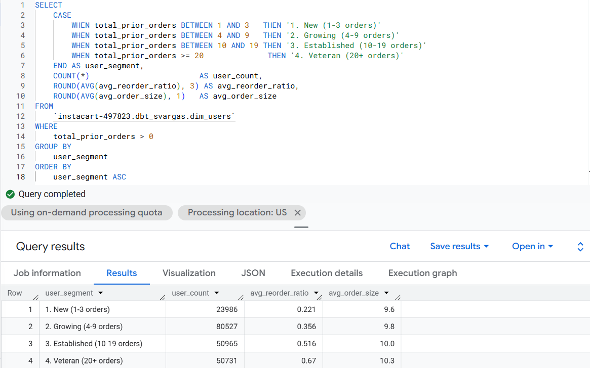
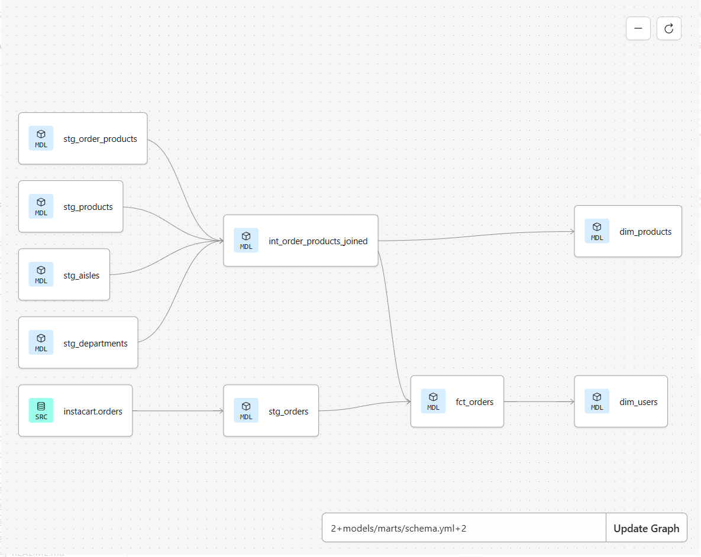
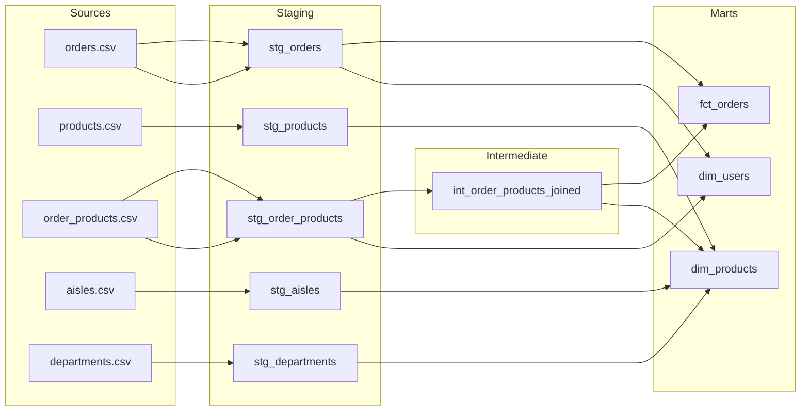
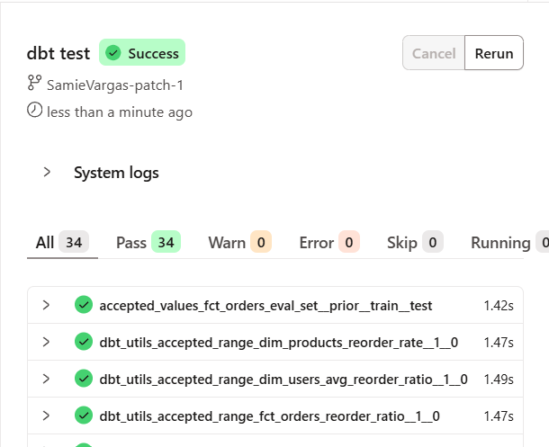

# Instacart dbt Project
### dbt Cloud · BigQuery · Looker/DataStudios · Staging → Intermediate → Mart · 3.4M Orders

> Instacart's dataset is the go-to for ML reorder prediction tutorials. This project ignores that problem entirely and asks a harder one: *what does the data need to look like before anyone can trust it?*

---

## Why This Project

I placed a grocery order yesterday. Yogurt, shakes, cottage cheese, produce - mostly dairy and fresh fruit for snacks. When I ran the first reorder rate query on this dataset, dairy eggs and produce came back as the top two most reordered departments at 67% and 65%. That wasn't a surprise, that perfectly matched my cart.

I alternate between two delivery platforms every one to two months: Amazon Whole Foods and HEB via Shipt. Both times, I start the same way, I open the reorder section, copy from a past order or click through frequent items, then add anything new. I don't usually browse, and I just restock. That behavior of habitual, category-driven, platform-sticky is exactly what this dataset is built to measure.

What's interesting is that Instacart still has HEB. It has more stores than either platform I use and more variety, but I just don't use it. I switched to Shipt when HEB partnered with them, and convenience kept me there. Instacart lost a loyal user not because of selection, but because a competing platform made the habit easier to maintain somewhere else. That's a churn story. And the `train` file in this dataset - the last order each user placed before disappearing from the data - is full of them.

Most projects built on this data go straight to ML reorder prediction. This one doesn't. Before any model touches the mart layer, the data needs to be trustworthy: grain enforced, assumptions documented, business logic tested. The Instacart CSVs ship with no enforced relationships, a `days_since_prior_order` column that silently caps at 30, and two order-product files that overlap in non-obvious ways. A raw join across them produces numbers that *look* correct and *are* wrong.

This project builds the transformation layer that makes the data trustworthy: a staging → intermediate → mart architecture in dbt on BigQuery that a data team could hand to an analyst and say: *this is correct, here is the proof.*

---

## The Churn Story in Three Screenshots

This is what user retention and reorder behavior looks like from the consumer side: the same pattern this dataset measures at 3.2 million orders.

**Whole Foods via Amazon:** past purchases, protein shakes, seaweed snacks, repeat items front and center


**HEB via Shipt:** 120 items in "Buy it again." Blackberries, Mootopia cottage cheese. The reorder basket is full.


**Instacart:** HEB is right there. 30 minute delivery. More stores than either platform I use. Still don't open it.


> The dataset's `train` file captures the last order a user placed before they stopped appearing in the data. This is what that looks like from the other side.

---

## Business Questions the Mart Layer Answers

- **Which product categories have the highest reorder rates?** Dairy eggs (0.67), beverages (0.653), and produce (0.65) — confirmed in FIND 01. Pets at 0.601 is the most interesting: small category, extremely loyal.
- **Does reorder rate hold across all user segments or only habitual shoppers?** No. New users (1-3 orders) reorder at 0.221. Veterans (20+ orders) reorder at 0.670. The population average of 0.60 hides a 3x difference - confirmed in FIND 02.
- **When does data become reliable for ML reorder prediction?** At 10+ orders. Below that threshold users are still exploring and their behavior is not yet predictive.
- Which aisles are most commonly a user's *first* reorder item: a proxy for habit formation? Still to explore - the mart layer is designed to support this query.

---

### FIND 02: Reorder Behavior by User Tenure

This is the finding that answers the thesis. The 0.60 average reorder ratio visible in the Looker Studio dashboard is a population average masking dramatically different behavior underneath.

| Segment | Users | Avg Reorder Ratio | Avg Order Size |
|---|---|---|---|
| New (1-3 orders) | 23,986 | 0.221 | 9.6 items |
| Growing (4-9 orders) | 80,527 | 0.356 | 9.8 items |
| Established (10-19 orders) | 50,965 | 0.516 | 10.0 items |
| Veteran (20+ orders) | 50,731 | 0.670 | 10.3 items |

Reorder behavior doesn't stabilize until around 10 orders. A new user has a 0.221 reorder ratio — they are still discovering the platform, not yet forming habits. A veteran user reorders 67% of their cart every time. That's a 3x difference between the same metric on the same platform.

**What this means for ML:** Any reorder prediction model trained on all users equally is being diluted by new user noise. The data only becomes reliable for reorder prediction at the Established tier — 10 or more orders. Users below that threshold behave differently enough that including them in a training set without a segment flag would hurt model performance.

This finding lives in `/analyses/find_02_user_segment_reorder.sql` as a BigQuery view (`vw_user_segment_reorder`) connected to the Looker Studio dashboard.



---

## Data Lineage





---

## Data Exploration: What I Found Before Writing a Single Model

Before touching dbt, I ran SQL directly in the BigQuery console to understand the data structure, confirm quality, and surface the first real findings. This step is what makes staging models intentional instead of just copies of raw tables.

All queries are in `/analyses/01_data_discovery.sql`.

---

### DISC 01: Table Row Counts

Confirmed all 6 tables loaded correctly from Kaggle via the bq CLI.


---

### DISC 02: The eval_set Split

Instacart split users into three groups for an ML competition: `prior` (all historical orders), `train` (each user's final order, labeled), and `test` (each user's final order, no labels). The key signal: `train` and `test` show exactly 1.0 orders per user — confirming they contain only the final order per user, not history. `prior` averages 15.6 orders per user. This is why the two order-product files can't be blindly unioned.


---

### QC 01: The days_since_prior_order Cap

`days_since_prior_order` is capped at 30 by Instacart. A value of 30 does not mean exactly 30 days — it means 30 or more. The spike at 369,323 orders vs. neighbors in the 19K–32K range makes this visible immediately. This is a censored observation, documented in the staging model so downstream analysts don't build time-decay models on silently broken inputs.


---

### QC 02: NULL Check on First Orders

`days_since_prior_order` should only be NULL on a user's first order — there's no prior order to measure from. The query confirmed 100% null on `order_number = 1` and 0% null on every order after. Clean. Documented in `stg_orders.sql` so no one filters these rows out incorrectly.


---

### FIND 01: Reorder Rate by Department

The first real finding. Dairy eggs (0.67), beverages (0.653), and produce (0.65) are the most reordered departments — all staple categories where users restock on autopilot. Pets at 0.601 is the most interesting: a small category (97K order lines) with extremely loyal repeat behavior. The bottom of the list is where discovery and impulse buying live.


---

## Test Results

35 tests across 3 mart models. All passing.



The tests that matter most aren't `not_null` and `unique` — those are table stakes. The ones worth noting:

```yaml
# reorder_ratio is bounded between 0 and 1
# a value above 1 means a join fanout upstream — caught before it reaches analysts
- name: reorder_ratio
  tests:
    - dbt_utils.accepted_range:
        min_value: 0
        max_value: 1
        where: "eval_set != 'test'"

# days_since_prior_order is only NULL on first orders
# confirmed in qc_02 — encoded here so the assumption is tested, not assumed
- name: days_since_prior_order
  tests:
    - not_null:
        where: "order_number > 1"
```

---

## Model Reference

| Model | Layer | Grain | Description |
|---|---|---|---|
| `stg_orders` | Staging | 1 row per order | Renamed columns, null handling on `days_since_prior_order`, cast types |
| `stg_products` | Staging | 1 row per product | Cleaned product names, foreign key normalization |
| `stg_order_products` | Staging | 1 row per order-product | Combines prior + train with a source_label column |
| `stg_aisles` | Staging | 1 row per aisle | Passthrough clean with renamed columns |
| `stg_departments` | Staging | 1 row per department | Passthrough clean with renamed columns |
| `int_order_products_joined` | Intermediate | 1 row per order-product | Products joined with aisle and department, reused by both marts |
| `fct_orders` | Mart | 1 row per order | Order-level metrics: size, reorder ratio, days since prior |
| `dim_products` | Mart | 1 row per product | Full product catalog with department, aisle, and reorder signal |
| `dim_users` | Mart | 1 row per user | User-level behavior: total orders, avg order size, reorder tendency |

---

## Project Structure

```
instacart_project/
├── analyses/
│   └── 01_data_discovery.sql        # All exploration queries in sequence
├── assets/
│   ├── dag_01_full_lineage.png
│   ├── disc_01_table_row_counts.png
│   ├── disc_02_eval_set_split.png
│   ├── disc_03_dbt_svargas_dataset_created.png
│   ├── disc_04_dbt_svargas_all_staging.png
│   ├── disc_05_dbt_svargas_intermediate.png
│   ├── disc_06_dbt_svargas_fct_orders.png
│   ├── disc_07_dbt_svargas_progress.png
│   ├── disc_08_dbt_svargas_dim_products_rowcount.png
│   ├── disc_09_dbt_svargas_dim_products_schema.png
│   ├── disc_10_dbt_svargas_dim_users_schema.png
│   ├── disc_11_dbt_svargas_dim_users_rowcount.png
│   ├── doc_01_dbt_test_all_passing.png
│   ├── find_01_reorder_rate_by_dept.png
│   ├── personal_heb_buy_again.png
│   ├── personal_instacart_has_heb.png
│   ├── personal_wf_reorder_history.png
│   ├── qc_01_days_since_prior_cap.png
│   └── qc_02_null_check_first_orders.png
├── models/
│   ├── staging/
│   │   ├── sources.yml
│   │   ├── stg_aisles.sql
│   │   ├── stg_departments.sql
│   │   ├── stg_order_products.sql
│   │   ├── stg_orders.sql
│   │   └── stg_products.sql
│   ├── intermediate/
│   │   └── int_order_products_joined.sql
│   └── marts/
│       ├── dim_products.sql
│       ├── dim_users.sql
│       ├── fct_orders.sql
│       └── schema.yml
├── packages.yml
├── dbt_project.yml
└── README.md
```

---

## Stack

| Layer | Tool |
|---|---|
| Transformation | dbt Cloud |
| Warehouse | BigQuery |
| Source Data | Instacart Online Grocery Shopping Dataset 2017 via Kaggle |
| Data Load | Kaggle CLI + bq CLI |
| Version Control | GitHub |
| Docs | dbt docs |

The Instacart CSVs load cleanly via the bq CLI, and BigQuery's partitioning and clustering options are relevant context for how you'd productionize `fct_orders` at scale.

---

## Technical Decisions Worth Noting

**Why an intermediate layer?**
`int_order_products_joined` handles the join of products → aisles → departments. Both `fct_orders` and `dim_products` need it. Without the intermediate model, that join logic lives in two places and drifts. One model, one test, two consumers.

**The `days_since_prior_order` cap problem:**
Instacart caps this column at 30. A value of `30` means "30 or more" - a censored observation, not a clean measurement. The staging model documents this. The mart model adds an `is_days_since_prior_capped` boolean flag so downstream analysts can filter or account for it without having to know the dataset quirk.

**The test set NULL problem:**
`order_size`, `reordered_items`, and `reorder_ratio` are NULL for all 75,000 test set orders because test orders have no product labels in the source data. This is expected, the `not_null` tests use `where: "eval_set != 'test'"` to encode that assumption rather than silently ignoring it.

**Why the intermediate model uses CTEs instead of a flat SELECT:**
Earlier versions were written as flat SELECTs with aliased `ref()` calls to work around a dbt Fusion preview engine bug with CTE column resolution. After reverting to the original CTE pattern and confirming the staging models were correctly in place, the issue resolved. The lesson: when a run completes in under 1 second on a 33M row table, verify the file actually saved before debugging the SQL.

---

## How to Reproduce

### Prerequisites

- Google Cloud account with a BigQuery project
- [Google Cloud SDK](https://cloud.google.com/sdk/docs/install) installed and authenticated
- [Kaggle account](https://www.kaggle.com) with API token configured
- Python 3.8+ (built on Windows with Python 3.13)
- dbt Cloud account connected to BigQuery and this GitHub repo

---

### Step 1: Get your Kaggle API token

Go to kaggle.com → profile icon → Settings → API → **Create New Token**. Downloads `kaggle.json` automatically.

```
mkdir %USERPROFILE%\.kaggle
move %USERPROFILE%\Downloads\kaggle.json %USERPROFILE%\.kaggle\kaggle.json
```

---

### Step 2: Install the Kaggle CLI

```
pip install kaggle
```

> **Windows PATH issue:** If `kaggle` isn't recognized after install, use the full executable path:
> ```
> C:\Users\<YourName>\AppData\Local\Packages\PythonSoftwareFoundation.Python.3.13_qbz5n2kfra8p0\LocalCache\local-packages\Python313\Scripts\kaggle.exe
> ```
> This happens when multiple Python versions are installed and pip installs to a version that isn't on PATH. Using the full path bypasses it entirely.

---

### Step 3: Authenticate with Google Cloud

```
gcloud init
gcloud auth application-default login
```

> These are two separate credentials. `gcloud init` sets up the CLI and selects your project. `application-default login` is what the bq CLI and dbt Cloud actually use to authenticate against BigQuery. Both are required — running only one will cause silent auth failures later.

---

### Step 4: Create the raw dataset in BigQuery

```
bq mk --dataset instacart-497823:instacart_raw
```

---

### Step 5: Download the dataset from Kaggle

```
cd %USERPROFILE%\Documents
mkdir instacart-data
cd instacart-data
```

```
kaggle.exe datasets download yasserh/instacart-online-grocery-basket-analysis-dataset --unzip --path .
```

---

### Step 6: Load all 6 CSVs into BigQuery

```
bq load --autodetect --source_format=CSV instacart-497823:instacart_raw.orders orders.csv
bq load --autodetect --source_format=CSV instacart-497823:instacart_raw.products products.csv
bq load --autodetect --source_format=CSV instacart-497823:instacart_raw.order_products_prior order_products__prior.csv
bq load --autodetect --source_format=CSV instacart-497823:instacart_raw.order_products_train order_products__train.csv
bq load --autodetect --source_format=CSV instacart-497823:instacart_raw.aisles aisles.csv
bq load --autodetect --source_format=CSV instacart-497823:instacart_raw.departments departments.csv
```

> The prior and train files are large — expect a few minutes each. The cursor sits there. That's normal, don't close the window.

---

### Step 7: Create the dbt dataset in BigQuery

dbt writes models to a separate dataset from the raw data. Create it manually before running dbt for the first time:

```sql
CREATE SCHEMA IF NOT EXISTS `instacart-497823.dbt_svargas`
```

> If you skip this step, dbt will report a successful run but nothing will appear in BigQuery. The run completes in under 1 second — that's the signal something is wrong.

---

### Step 8: Verify raw data in BigQuery

Run `/analyses/01_data_discovery.sql` section by section before building any models. Confirm row counts, eval_set split, and the days_since_prior_order cap.

---

### Step 9: Install dbt packages

```
dbt deps
```

This installs `dbt_utils` from `packages.yml`. Required before running tests — `dbt_utils.accepted_range` will throw `undefined` errors without it.

---

### Step 10: Run dbt

```
dbt run --full-refresh   # builds all models, forces rebuild
dbt test                 # runs all 35 tests
dbt docs generate        # generates documentation and DAG
```

> Use `--full-refresh` on first run. Without it, dbt Fusion may report success without actually writing anything if it thinks a model already exists.

---

## What I'd Build Next

The mart layer answers retrospective questions about what users did. The next layer worth building is a cohort model: bucketing users by first-order week and tracking order frequency decay over time. That requires a date spine (`dbt_utils.date_spine` macro) and a left join pattern the current mart structure is already designed to support.

It's not in this repo because it belongs in an analytics layer, not a transformation layer. The line matters.

---

*Instacart Online Grocery Shopping Dataset 2017 · Loaded via Kaggle API + bq CLI · Transformed with dbt Cloud on BigQuery*
