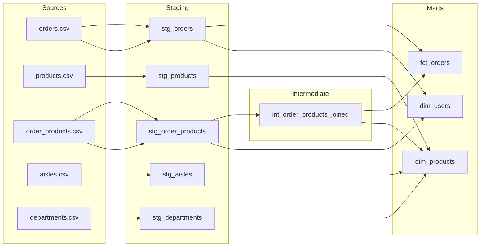

# Instacart dbt Project
### dbt Core · BigQuery · Staging → Intermediate → Mart · 3.4M Orders

> Instacart's dataset is the go-to for ML reorder prediction tutorials. This project ignores that problem entirely and asks a harder one: *what does the data need to look like before anyone can trust it?*

---

## Why This Project

The Instacart dataset ships as five flat CSVs with no enforced relationships, no column documentation, and no grain clarity. `order_products__prior.csv` and `order_products__train.csv` overlap in non-obvious ways. `days_since_prior_order` caps at 30 with no explanation. A raw join across these files will produce numbers that *look* correct and *are* wrong.

This project builds the transformation layer that makes the data trustworthy - a staging → intermediate → mart architecture in dbt, running on BigQuery, that enforces grain, documents assumptions, and tests business logic before any analysis touches the mart layer.

The goal is not a dashboard. It is a model layer a data team could hand to an analyst and say: *this is correct, here is the proof.*

---

## Business Questions the Mart Layer Answers
1. Which product categories have the highest reorder rates, and does that hold across all user tenure segments, or only habitual shoppers?
2. Is there a measurable drop in order frequency after a user's first 30 days?
3. Which aisles are most commonly a user's *first* reorder item - a proxy for habit formation?

---

## Data Lineage



---

## Model Reference

| Model | Layer | Grain | Description |
|---|---|---|---|
| `stg_orders` | Staging | 1 row per order | Renamed columns, null handling on `days_since_prior_order`, cast types |
| `stg_products` | Staging | 1 row per product | Cleaned product names, foreign key normalization |
| `stg_order_products` | Staging | 1 row per order-product | Combines prior + train sets with a source label |
| `stg_aisles` | Staging | 1 row per aisle | Passthrough clean with renamed columns |
| `stg_departments` | Staging | 1 row per department | Passthrough clean with renamed columns |
| `int_order_products_joined` | Intermediate | 1 row per order-product | Products joined with aisle and department — reused by both marts |
| `fct_orders` | Mart | 1 row per order | Order-level metrics: size, reorder ratio, days since prior |
| `dim_products` | Mart | 1 row per product | Full product catalog with department, aisle, and reorder signal |
| `dim_users` | Mart | 1 row per user | User-level behavior: total orders, avg order size, reorder tendency |

---

## Testing Strategy

Every mart column with a business rule has a test. Not just `not_null` and `unique` — those are table stakes.

```yaml
# The interesting tests are the ones that encode assumptions
- name: days_since_prior_order
  tests:
    - not_null:
        where: "order_number > 1"    # NULL is only valid on a user's first order
    - dbt_utils.accepted_range:
        min_value: 0
        max_value: 30                # Dataset caps at 30 — anything over is a data error

- name: reorder_ratio
  tests:
    - dbt_utils.accepted_range:
        min_value: 0
        max_value: 1                 # A value > 1 means a join fanout upstream
```

---

## Project Structure

```
instacart_project/
├── models/
│   ├── staging/
│   │   ├── stg_orders.sql
│   │   ├── stg_products.sql
│   │   ├── stg_order_products.sql
│   │   ├── stg_aisles.sql
│   │   ├── stg_departments.sql
│   │   └── schema.yml
│   ├── intermediate/
│   │   ├── int_order_products_joined.sql
│   │   └── schema.yml
│   └── marts/
│       ├── fct_orders.sql
│       ├── dim_products.sql
│       ├── dim_users.sql
│       └── schema.yml
├── macros/
│   └── generate_schema_name.sql
├── tests/
│   └── assert_reorder_ratio_bounded.sql
├── exposures.yml
├── dbt_project.yml
└── README.md
```

---

## Stack

| Layer | Tool |
|---|---|
| Transformation | dbt Core |
| Warehouse | BigQuery |
| Source Data | Instacart Dataset via Kaggle (3.4M orders, 5 CSVs) |
| Docs | dbt docs (hosted via GitHub Pages) |

The Instacart CSVs load cleanly into BigQuery external tables, and BigQuery's partitioning and clustering options are relevant context for how you'd productionize a model like `fct_orders` at scale (partitioned on `order_dow`, clustered on `user_id`).

---

## Technical Decisions Worth Noting

**Why an intermediate layer?**
`int_order_products_joined` handles the join of products → aisles → departments. Both `fct_orders` and `dim_products` need it. Without the intermediate model, that join logic lives in two places and drifts. One model, one test, two consumers.

**The `days_since_prior_order` cap problem:**
Instacart caps this column at 30. That means a value of `30` means "30 or more" — it's a censored observation, not a clean measurement. The staging model documents this in the column description. The mart model flags orders where the cap is likely active so downstream analysts aren't building time-decay models on silently broken inputs.

**Why a singular test for reorder ratio?**
The schema test `accepted_range` catches bad output values. The singular test in `/tests/` catches the *cause* — a fanout join that inflates row counts before the ratio is even calculated. Testing the symptom in schema.yml is not the same as testing the upstream condition that produces it.

---

## How to Run

```bash
# Clone and install
git clone https://github.com/yourusername/instacart-project.git
cd instacart-project
pip install dbt-bigquery

# Configure your profile
cp profiles_template.yml ~/.dbt/profiles.yml
# Edit with your BigQuery project + dataset credentials

# Seed the raw CSVs
dbt seed

# Run models
dbt run

# Test
dbt test

# Generate and serve docs locally
dbt docs generate
dbt docs serve
```

---

## What I'd Build Next

The mart layer answers retrospective questions about what users did. The next layer worth building is a cohort model — bucketing users by first-order week and tracking order frequency decay over time. That requires a date spine (`dbt_utils.date_spine` macro) and a left join pattern the current mart structure is already designed to support.

It's not in this repo because it belongs in an analytics layer, not a transformation layer. The line matters.

---

*Built as part of the [dbt Fundamentals](https://courses.getdbt.com/courses/fundamentals) course · Instacart Dataset via Kaggle*
