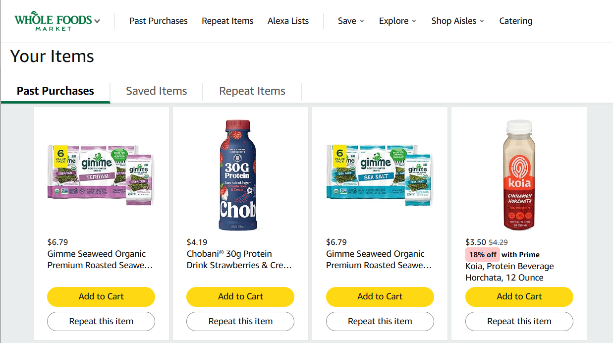
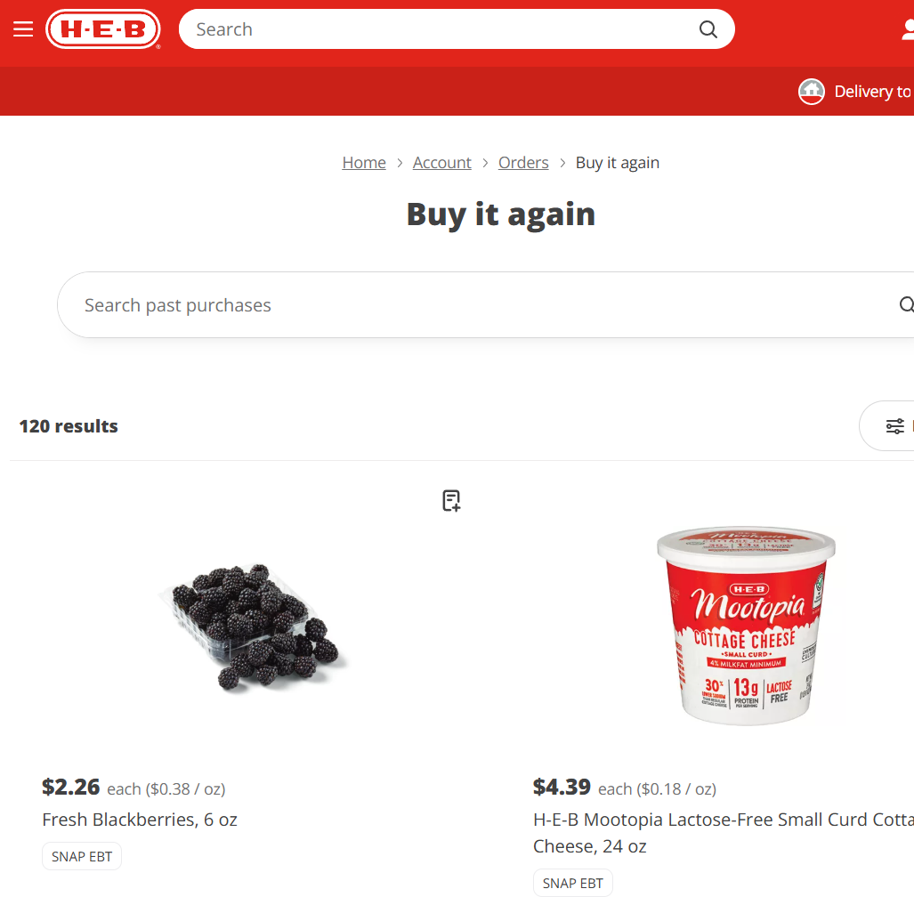
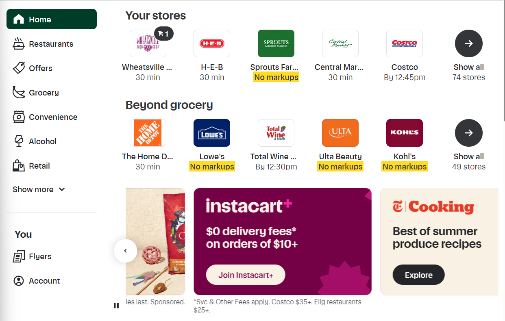
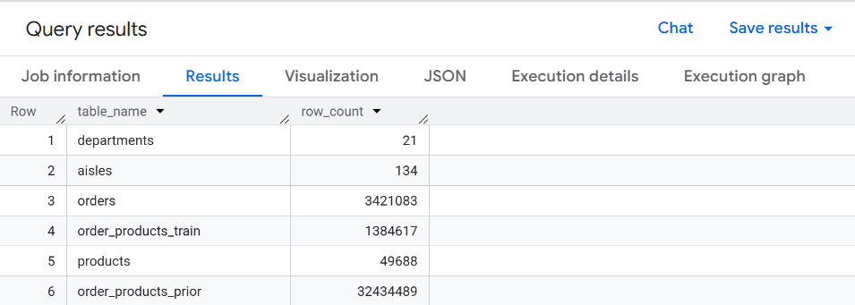
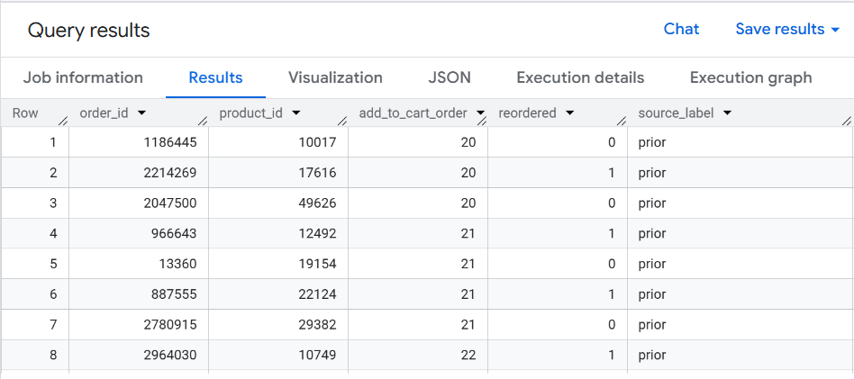
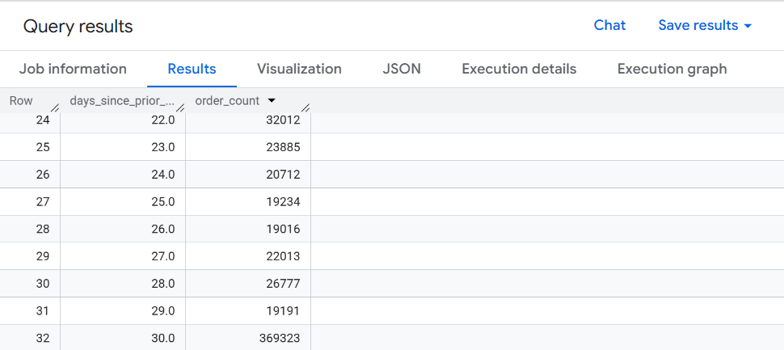
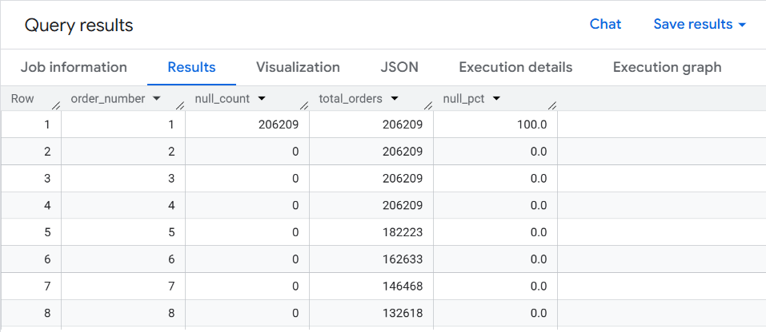
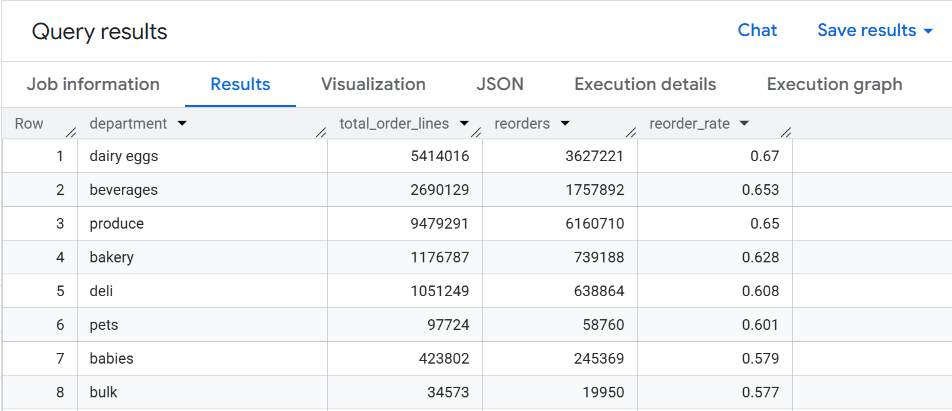
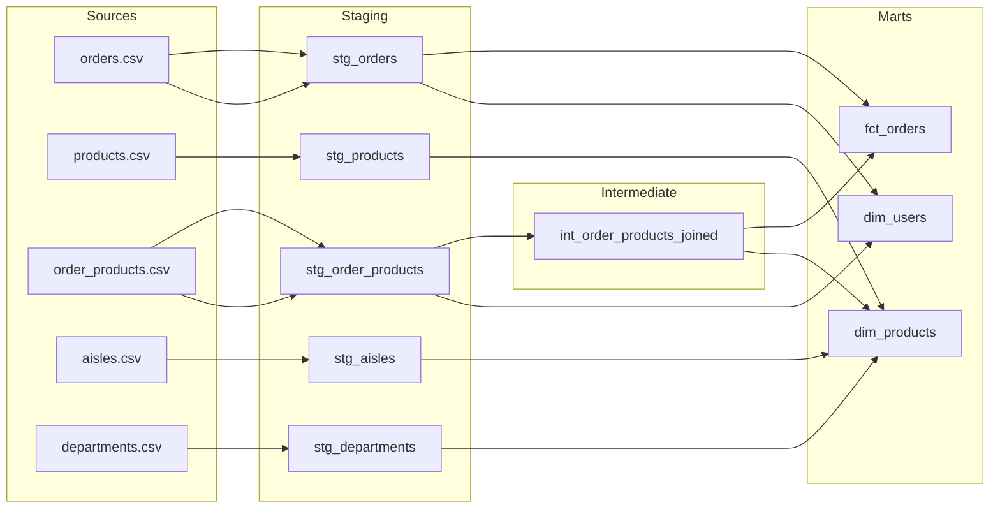

# Instacart dbt Project
### dbt Core · BigQuery · Staging → Intermediate → Mart · 3.4M Orders

> Instacart's dataset is the go-to for ML reorder prediction tutorials. This project ignores that problem entirely and asks a harder one: *what does the data need to look like before anyone can trust it?*

---

## Why This Project

I placed a grocery order yesterday. Yogurt, shakes, cottage cheese, produce - mostly dairy and fresh. When I ran the first reorder rate query on this dataset, dairy eggs and produce came back as the top two most reordered departments at 67% and 65%. That wasn't a surprise, as that was my cart.

I alternate between two delivery platforms every one to two months: Amazon Whole Foods and HEB via Shipt. Both times, I start the same way by opening the reorder section, copying from a past order or clicking through frequent items, then adding anything new. I don't usually browse, I more often restock. That behavior - habitual, category-driven, platform-sticky - is exactly what this dataset is built to measure.

What's interesting is that Instacart still has HEB. It has more stores than either platform I use and more variety. But I don't use it. I switched to Shipt when HEB partnered with them, and convenience kept me there. Instacart lost a loyal user not because of selection, but because a competing platform made the habit easier to maintain somewhere else. That's a churn story. And the `train` file in this dataset, the last order each user placed before disappearing from the data, is full of them.

Most projects built on this data go straight to ML reorder prediction. This one doesn't. Before any model touches the mart layer, the data needs to be trustworthy: grain enforced, assumptions documented, business logic tested. The Instacart CSVs ship with no enforced relationships, a `days_since_prior_order` column that silently caps at 30, and two order-product files that overlap in non-obvious ways. A raw join across them produces numbers that *look* correct and *are* wrong.

This project builds the transformation layer that makes the data trustworthy: a staging → intermediate → mart architecture in dbt on BigQuery that a data team could hand to an analyst and say: *this is correct, here is the proof.*

---

## The Churn Story in Three Screenshots

This is what user retention and reorder behavior looks like from the consumer side: the same pattern this dataset measures at 3.2 million orders.

**Whole Foods via Amazon:** past purchases, protein shakes, seaweed snacks, repeat items front and center


**HEB via Shipt:** 120 items in "Buy it again." Blackberries, Mootopia cottage cheese. The reorder basket is full.


**Instacart:** HEB is right there with 30 minute delivery. Instacart has more stores than either platform I use, but I still don't open it.


> The dataset's `train` file captures the last order a user placed before they stopped appearing in the data. This is what that looks like from the other side.

---

## Business Questions the Mart Layer Answers
- Which product categories have the highest reorder rates, and does that hold across all user tenure segments or only habitual shoppers?
- Is there a measurable drop in order frequency after a user's first 30 days?
- Which aisles are most commonly a user's *first* reorder item: a proxy for habit formation?

---

## Data Exploration: What I Found Before Writing a Single Model

Before touching dbt, I ran a series of SQL queries directly in the BigQuery console to understand the data structure, confirm quality, and surface the first real findings. This step is what makes the staging models intentional instead of just copies of the raw tables.

All queries are in `/analysis/01_data_discovery.sql`.

---

### DISC 01: Table Row Counts

Confirmed all 6 tables loaded correctly from Kaggle via the bq CLI.



---

### DISC 02: The eval_set Split

Instacart split users into three groups for an ML competition: `prior` (all historical orders), `train` (each user's final order, labeled), and `test` (each user's final order, no labels). The key signal: `train` and `test` show exactly 1.0 orders per user — confirming they contain only the final order per user, not history. `prior` averages 15.6 orders per user. This is why the two order-product files can't be blindly unioned.



---

### QC 01: The days_since_prior_order Cap

`days_since_prior_order` is capped at 30 by Instacart. A value of 30 does not mean exactly 30 days — it means 30 or more. The spike at row 32 (369,323 orders) vs. neighbors in the 19K–32K range makes this visible immediately. This is a censored observation, documented in the staging model so downstream analysts don't build time-decay models on silently broken inputs.



---

### QC 02: NULL Check on First Orders

`days_since_prior_order` should only be NULL on a user's first order — there's no prior order to measure from. The query confirmed 100% null on `order_number = 1` and 0% null on every order after. Clean. This is documented as an intentional design decision in `stg_orders.sql` so no one filters these rows out incorrectly.



---

### FIND 01: Reorder Rate by Department

The first real finding. Dairy eggs (0.67), beverages (0.653), and produce (0.65) are the most reordered departments — all staple categories where users restock on autopilot rather than browse. Pets at 0.601 is the most interesting: a small category (97K order lines) with extremely loyal repeat behavior. The bottom of the list is where discovery and impulse buying live — that contrast is worth exploring in the mart layer.



---

## Data Lineage



---

## Model Reference

| Model | Layer | Grain | Description |
|---|---|---|---|
| `stg_orders` | Staging | 1 row per order | Renamed columns, null handling on `days_since_prior_order`, cast types |
| `stg_products` | Staging | 1 row per product | Cleaned product names, foreign key normalization |
| `stg_order_products` | Staging | 1 row per order-product | Combines prior + train with a source_label column |
| `stg_aisles` | Staging | 1 row per aisle | Passthrough clean with renamed columns |
| `stg_departments` | Staging | 1 row per department | Passthrough clean with renamed columns |
| `int_order_products_joined` | Intermediate | 1 row per order-product | Products joined with aisle and department, reused by both marts |
| `fct_orders` | Mart | 1 row per order | Order-level metrics: size, reorder ratio, days since prior |
| `dim_products` | Mart | 1 row per product | Full product catalog with department, aisle, and reorder signal |
| `dim_users` | Mart | 1 row per user | User-level behavior: total orders, avg order size, reorder tendency |

---

## Testing Strategy

Every mart column with a business rule has a test. Not just `not_null` and `unique` — those are table stakes.

```yaml
# The interesting tests are the ones that encode assumptions
- name: days_since_prior_order
  tests:
    - not_null:
        where: "order_number > 1"    # NULL is only valid on a user's first order
    - dbt_utils.accepted_range:
        min_value: 0
        max_value: 30                # Dataset caps at 30, anything over is a data error

- name: reorder_ratio
  tests:
    - dbt_utils.accepted_range:
        min_value: 0
        max_value: 1                 # A value > 1 means a join fanout upstream
```

---

## Project Structure

```
instacart_project/
├── analysis/
│   └── 01_data_discovery.sql       # All exploration queries in sequence
├── assets/
│   ├── disc_01_table_row_counts.png
│   ├── disc_02_eval_set_split.png
│   ├── qc_01_days_since_prior_cap.png
│   ├── qc_02_null_check_first_orders.png
│   ├── find_01_reorder_rate_by_dept.png
│   ├── personal_wf_reorder_history.png
│   ├── personal_heb_buy_again.png
│   └── personal_instacart_has_heb.png
├── models/
│   ├── staging/
│   │   ├── stg_orders.sql
│   │   ├── stg_products.sql
│   │   ├── stg_order_products.sql
│   │   ├── stg_aisles.sql
│   │   ├── stg_departments.sql
│   │   └── schema.yml
│   ├── intermediate/
│   │   ├── int_order_products_joined.sql
│   │   └── schema.yml
│   └── marts/
│       ├── fct_orders.sql
│       ├── dim_products.sql
│       ├── dim_users.sql
│       └── schema.yml
├── macros/
│   └── generate_schema_name.sql
├── tests/
│   └── assert_reorder_ratio_bounded.sql
├── exposures.yml
├── dbt_project.yml
└── README.md
```

---

## Stack

| Layer | Tool |
|---|---|
| Transformation | dbt Cloud |
| Warehouse | BigQuery |
| Source Data | Instacart Dataset via Kaggle (3.4M orders, 6 CSVs) |
| Data Load | Kaggle CLI + bq CLI |
| Docs | dbt docs via GitHub Pages |

BigQuery was the deliberate choice here: not the tutorial default. The Instacart CSVs load cleanly via the bq CLI, and BigQuery's partitioning and clustering options are relevant context for how you'd productionize `fct_orders` at scale (partitioned on `order_dow`, clustered on `user_id`).

---

## Technical Decisions Worth Noting

**Why an intermediate layer?**
`int_order_products_joined` handles the join of products → aisles → departments. Both `fct_orders` and `dim_products` need it. Without the intermediate model, that join logic lives in two places and drifts. One model, one test, two consumers.

**The `days_since_prior_order` cap problem:**
Instacart caps this column at 30. That means a value of `30` means "30 or more" — a censored observation, not a clean measurement. The staging model documents this in the column description. The mart model flags orders where the cap is likely active so downstream analysts aren't building time-decay models on silently broken inputs.

**Why a singular test for reorder ratio?**
The schema test `accepted_range` catches bad output values. The singular test in `/tests/` catches the *cause*: a fanout join that inflates row counts before the ratio is even calculated. Testing the symptom in schema.yml is not the same as testing the upstream condition that produces it.

---

## How to Reproduce

### Prerequisites

- Google Cloud account with a BigQuery project created
- [Google Cloud SDK](https://cloud.google.com/sdk/docs/install) installed and authenticated
- [Kaggle account](https://www.kaggle.com) with API token configured
- Python 3.8+ (this was built on Windows with Python 3.13)
- dbt Cloud account connected to BigQuery and this GitHub repo

---

### Step 1: Get your Kaggle API token

Go to kaggle.com → profile icon → Settings → API → **Create New Token**. It downloads `kaggle.json` automatically.

Move it to the right place:

```
mkdir %USERPROFILE%\.kaggle
move %USERPROFILE%\Downloads\kaggle.json %USERPROFILE%\.kaggle\kaggle.json
```

---

### Step 2: Install the Kaggle CLI

```
pip install kaggle
```

> **Windows gotcha:** If `kaggle` isn't recognized after install, it's a PATH issue. Use the full path to the executable instead:
> ```
> C:\Users\<YourName>\AppData\Local\Packages\PythonSoftwareFoundation.Python.3.13_qbz5n2kfra8p0\LocalCache\local-packages\Python313\Scripts\kaggle.exe
> ```

---

### Step 3: Authenticate with Google Cloud

```
gcloud init
gcloud auth application-default login
```

> These are two different credentials. `gcloud init` sets up the CLI. `application-default login` is what dbt and the bq CLI actually use to authenticate. Both are required.

---

### Step 4: Create the raw dataset in BigQuery

```
bq mk --dataset instacart-497823:instacart_raw
```

---

### Step 5: Download the dataset from Kaggle

```
cd %USERPROFILE%\Documents
mkdir instacart-data
cd instacart-data
```

```
kaggle.exe datasets download yasserh/instacart-online-grocery-basket-analysis-dataset --unzip --path .
```

---

### Step 6: Load all 6 CSVs into BigQuery

```
bq load --autodetect --source_format=CSV instacart-497823:instacart_raw.orders orders.csv
bq load --autodetect --source_format=CSV instacart-497823:instacart_raw.products products.csv
bq load --autodetect --source_format=CSV instacart-497823:instacart_raw.order_products_prior order_products__prior.csv
bq load --autodetect --source_format=CSV instacart-497823:instacart_raw.order_products_train order_products__train.csv
bq load --autodetect --source_format=CSV instacart-497823:instacart_raw.aisles aisles.csv
bq load --autodetect --source_format=CSV instacart-497823:instacart_raw.departments departments.csv
```

> The prior and train files are large. Expect a few minutes each — the cursor will sit there. That's normal.

---

### Step 7: Verify in BigQuery

Run `/analysis/01_data_discovery.sql` section by section in the BigQuery console. Confirm row counts, eval_set split, and the days_since_prior_order cap before building any models.

---

### Step 8: Run dbt via dbt Cloud

This project uses dbt Cloud connected to BigQuery and this GitHub repo. No local dbt installation needed.

```
dbt run            # builds all models
dbt test           # runs all tests
dbt docs generate  # generates documentation
```

---

## What I'd Build Next

The mart layer answers retrospective questions about what users did. The next layer worth building is a cohort model: bucketing users by first-order week and tracking order frequency decay over time. That requires a date spine (`dbt_utils.date_spine` macro) and a left join pattern the current mart structure is already designed to support.

It's not in this repo because it belongs in an analytics layer, not a transformation layer. The line matters.

---

*Instacart Online Grocery Shopping Dataset 2017 · Loaded via Kaggle API + bq CLI · Transformed with dbt Cloud on BigQuery*
