# Instacart dbt Project

[](https://github.com/SamieVargas/instacart-project/actions/workflows/dbt.yml)

A dbt Cloud project on BigQuery that turns the six raw Instacart CSVs (3.4M orders, 206,209 users, 49,677 products) into a tested staging → intermediate → mart layer, so an analyst can query the marts without re-deriving the dataset's quirks first. Built for a data team that needs the transformation layer to be trustworthy before any reorder model touches it. The marts feed a Looker Studio dashboard through a BigQuery view.

dbt Cloud · BigQuery · Looker/DataStudios · Staging → Intermediate → Mart · 3.4M Orders

> Instacart's dataset is the go-to for ML reorder prediction tutorials. This project ignores that problem entirely and asks a harder one: *what does the data need to look like before anyone can trust it?*

---

## Problem

I placed a grocery order yesterday. Yogurt, shakes, cottage cheese, produce - mostly dairy and fresh fruit for snacks. When I ran the first reorder rate query on this dataset, dairy eggs and produce came back as the top two most reordered departments at 67% and 65%. That wasn't a surprise, that perfectly matched my cart.

I alternate between two delivery platforms every one to two months: Amazon Whole Foods and HEB via Shipt. Both times, I start the same way, I open the reorder section, copy from a past order or click through frequent items, then add anything new. I don't usually browse, and I just restock. That behavior of habitual, category-driven, platform-sticky is exactly what this dataset is built to measure.

What's interesting is that Instacart still has HEB. It has more stores than either platform I use and more variety, but I just don't use it. I switched to Shipt when HEB partnered with them, and convenience kept me there. Instacart lost a loyal user not because of selection, but because a competing platform made the habit easier to maintain somewhere else. That's a churn story. And the `train` file in this dataset - the last order each user placed before disappearing from the data - is full of them.

Most projects built on this data go straight to ML reorder prediction. This one doesn't. Before any model touches the mart layer, the data needs to be trustworthy: grain enforced, assumptions documented, business logic tested. The Instacart CSVs ship with no enforced relationships, a `days_since_prior_order` column that silently caps at 30, and two order-product files that overlap in non-obvious ways. A raw join across them produces numbers that *look* correct and *are* wrong.

What this replaced is the work done by hand before it existed: every analyst re-discovering the 30-day cap, the NULL on first orders, and the prior/train/test split on their own, in their own ad hoc SQL, with no shared place where those rules were written down or checked. This project builds the transformation layer that makes the data trustworthy: a staging → intermediate → mart architecture in dbt on BigQuery that a data team could hand to an analyst and say: *this is correct, here is the proof.*

### The churn story in three screenshots

This is what user retention and reorder behavior looks like from the consumer side: the same pattern this dataset measures at 3.2 million prior orders.

**Whole Foods via Amazon:** past purchases, protein shakes, seaweed snacks, repeat items front and center
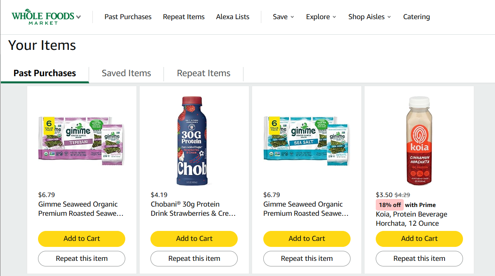

**HEB via Shipt:** 120 items in "Buy it again." Blackberries, Mootopia cottage cheese. The reorder basket is full.
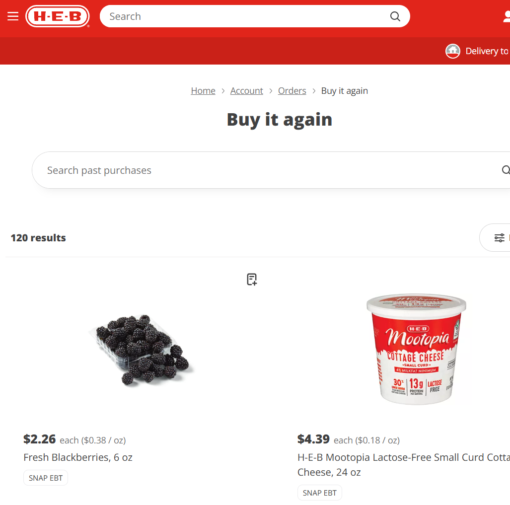

**Instacart:** HEB is right there. 30 minute delivery. More stores than either platform I use. Still don't open it.
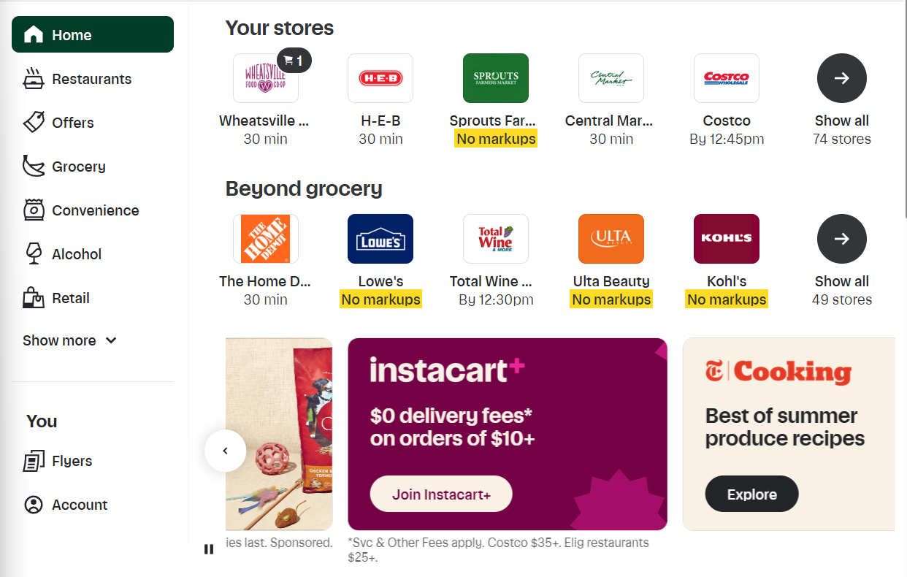

> The dataset's `train` file captures the last order a user placed before they stopped appearing in the data. This is what that looks like from the other side.

---

## Architecture

Every box below is `[code]`: deterministic SQL and YAML that dbt compiles and BigQuery runs, testable without a model. There is no `[model]` box because nothing in this repo makes a model call; the two-kind labeling is kept so this README reads the same way as my other repos, where some boxes are probabilistic.

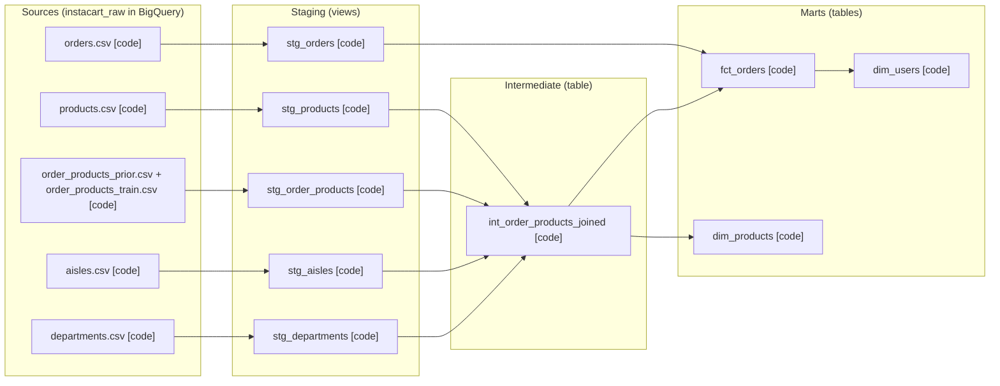
```mermaid
graph LR
    subgraph Sources ["Sources (instacart_raw in BigQuery)"]
        A["orders.csv [code]"]
        B["products.csv [code]"]
        C["order_products_prior.csv + order_products_train.csv [code]"]
        D["aisles.csv [code]"]
        E["departments.csv [code]"]
    end

    subgraph Staging ["Staging (views)"]
        F["stg_orders [code]"]
        G["stg_products [code]"]
        H["stg_order_products [code]"]
        I["stg_aisles [code]"]
        J["stg_departments [code]"]
    end

    subgraph Intermediate ["Intermediate (table)"]
        K["int_order_products_joined [code]"]
    end

    subgraph Marts ["Marts (tables)"]
        L["fct_orders [code]"]
        M["dim_products [code]"]
        N["dim_users [code]"]
    end

    A --> F --> L --> N
    B --> G --> K
    C --> H --> K --> L
    D --> I --> K
    E --> J --> K
    K --> M
```

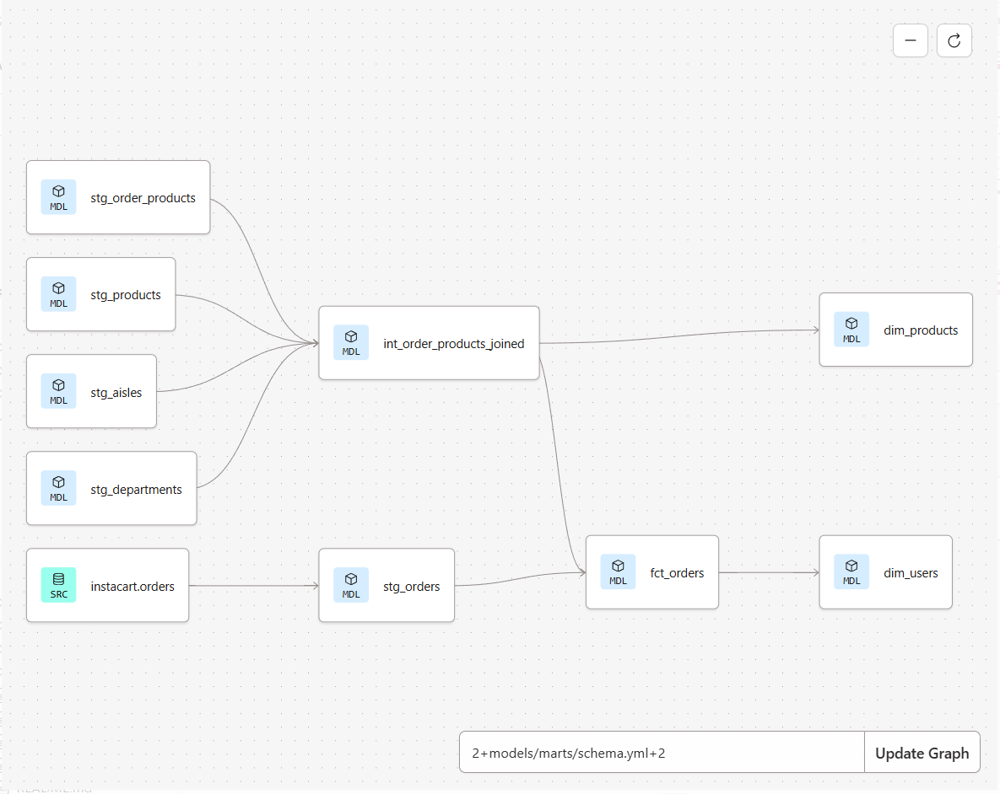

### Walking through the boxes

**Sources.** `models/staging/sources.yml` points dbt at the six raw tables in `instacart-497823.instacart_raw`, loaded from the Kaggle CSVs with the bq CLI. `order_products_prior` is the shopping history file: 3.2M orders across 206K users before their final order. `order_products_train` is each train user's final, labeled order. The `test` eval set has no order-product file at all.

**Staging** (`models/staging/`, materialized as views by `dbt_project.yml`). One model per source table, clean and rename only, no joins, no aggregations, no business logic. `stg_order_products` is the one exception in shape: it unions `prior` and `train` and adds a `source_label` column so every downstream model knows which file a row came from. The test set is excluded here on purpose, because it has no `reordered` labels.

**Intermediate** (`models/intermediate/`). `int_order_products_joined` joins `stg_order_products` to `stg_products`, `stg_aisles` and `stg_departments` in one place, at the order-product grain. `dbt_project.yml` sets the intermediate folder to views, but this model overrides that with `{{ config(materialized='table') }}` in the SQL, so it is built as a table.

**Marts** (`models/marts/`, materialized as tables). `fct_orders` aggregates the intermediate table back to one row per order and left joins it onto `stg_orders`, so orders with no product rows (the test set) are kept with NULL metrics rather than dropped. `dim_products` aggregates the intermediate table to product grain over prior orders only. `dim_users` aggregates `fct_orders` to user grain.

### Model reference

| Model | Layer | Grain | Description |
|---|---|---|---|
| `stg_orders` | Staging | 1 row per order | Renamed columns, null handling on `days_since_prior_order`, cast types |
| `stg_products` | Staging | 1 row per product | Cleaned product names, foreign key normalization |
| `stg_order_products` | Staging | 1 row per order-product | Combines prior + train with a source_label column |
| `stg_aisles` | Staging | 1 row per aisle | Passthrough clean with renamed columns |
| `stg_departments` | Staging | 1 row per department | Passthrough clean with renamed columns |
| `int_order_products_joined` | Intermediate | 1 row per order-product | Products joined with aisle and department, reused by both marts |
| `fct_orders` | Mart | 1 row per order | Order-level metrics: size, reorder ratio, days since prior |
| `dim_products` | Mart | 1 row per product | Full product catalog with department, aisle, and reorder signal |
| `dim_users` | Mart | 1 row per user | User-level behavior: total orders, avg order size, reorder tendency |

### What is enforced in code, and what is only documented

Enforced by dbt tests in `models/staging/schema.yml` and `models/marts/schema.yml` (the run fails if any of these is violated):

- Grain: `unique` + `not_null` on `stg_orders.order_id`, `stg_products.product_id`, `stg_aisles.aisle_id`, `stg_departments.department_id`, `fct_orders.order_id`, `dim_products.product_id`, `dim_users.user_id`.
- Allowed values: `accepted_values` on `eval_set` (`prior`, `train`, `test`) in `stg_orders` and `fct_orders`, on `source_label` (`prior`, `train`) in `stg_order_products`, and on `reordered` (`0`, `1`).
- Bounds: `dbt_utils.accepted_range` 0 to 1 on `fct_orders.reorder_ratio` (where `eval_set != 'test'`), `dim_products.reorder_rate` and `dim_users.avg_reorder_ratio`. A value above 1 can only come from a join fanout upstream.
- Conditional nulls: `not_null` on `days_since_prior_order` where `order_number > 1`; `not_null` on `order_size`, `reordered_items` and `reorder_ratio` where `eval_set != 'test'`.

Enforced by the SQL itself:

- `stg_order_products` never includes the test set, and every row carries `source_label`.
- `dim_products` filters to `source_label = 'prior'`, so the final labeled order does not leak into behavioral history.
- `fct_orders.is_days_since_prior_capped` and `dim_users.has_capped_order` flag the 30-day cap so analysts do not have to know the quirk.
- Materializations come from `dbt_project.yml` (staging and intermediate views, marts tables) with the one model-level override noted above.

Only documented, not enforced:

- That a `days_since_prior_order` of 30 means "30 or more" is a flag and a column description, not a test. Nothing stops a downstream query from treating 30 as exact.
- The FIND 02 user segment thresholds (1-3, 4-9, 10-19, 20+ orders) live in a BigQuery view created from `analyses/find_02_user_segment_reorder.sql`, outside the dbt DAG, so they are not tested.
- `sources.yml` mentions that dbt can run freshness checks, but no `freshness` block is configured.

### Technical decisions worth noting

**Why an intermediate layer?**
`int_order_products_joined` handles the join of products → aisles → departments. Both `fct_orders` and `dim_products` need it. Without the intermediate model, that join logic lives in two places and drifts. One model, one test, two consumers.

**The `days_since_prior_order` cap problem:**
Instacart caps this column at 30. A value of `30` means "30 or more" - a censored observation, not a clean measurement. The staging model documents this. The mart model adds an `is_days_since_prior_capped` boolean flag so downstream analysts can filter or account for it without having to know the dataset quirk.

**The test set NULL problem:**
`order_size`, `reordered_items`, and `reorder_ratio` are NULL for all 75,000 test set orders because test orders have no product labels in the source data. This is expected, the `not_null` tests use `where: "eval_set != 'test'"` to encode that assumption rather than silently ignoring it.

**Why the intermediate model uses CTEs instead of a flat SELECT:**
Earlier versions were written as flat SELECTs with aliased `ref()` calls to work around a dbt Fusion preview engine bug with CTE column resolution. After reverting to the original CTE pattern and confirming the staging models were correctly in place, the issue resolved. The lesson: when a run completes in under 1 second on a 33M row table, verify the file actually saved before debugging the SQL.

### Stack

| Layer | Tool |
|---|---|
| Transformation | dbt Cloud |
| Warehouse | BigQuery |
| Source Data | Instacart Online Grocery Shopping Dataset 2017 via Kaggle |
| Data Load | Kaggle CLI + bq CLI |
| Version Control | GitHub |
| Docs | dbt docs |
| CI | GitHub Actions running `dbt parse` (no warehouse connection) |

The Instacart CSVs load cleanly via the bq CLI, and BigQuery's partitioning and clustering options are relevant context for how you'd productionize `fct_orders` at scale.

---

## How to run

### Prerequisites

- Google Cloud account with a BigQuery project
- [Google Cloud SDK](https://cloud.google.com/sdk/docs/install) installed and authenticated
- [Kaggle account](https://www.kaggle.com) with API token configured
- Python 3.8+ (built on Windows with Python 3.13)
- dbt Cloud account connected to BigQuery and this GitHub repo

The commands that matter, once the data is loaded, are `dbt deps`, `dbt run --full-refresh` and `dbt test`. The full path from an empty BigQuery project follows.

### Step 1: Get your Kaggle API token

Go to kaggle.com → profile icon → Settings → API → **Create New Token**. Downloads `kaggle.json` automatically.

```
mkdir %USERPROFILE%\.kaggle
move %USERPROFILE%\Downloads\kaggle.json %USERPROFILE%\.kaggle\kaggle.json
```

### Step 2: Install the Kaggle CLI

```
pip install kaggle
```

> **Windows PATH issue:** If `kaggle` isn't recognized after install, use the full executable path:
> ```
> C:\Users\<YourName>\AppData\Local\Packages\PythonSoftwareFoundation.Python.3.13_qbz5n2kfra8p0\LocalCache\local-packages\Python313\Scripts\kaggle.exe
> ```
> This happens when multiple Python versions are installed and pip installs to a version that isn't on PATH. Using the full path bypasses it entirely.

### Step 3: Authenticate with Google Cloud

```
gcloud init
gcloud auth application-default login
```

> These are two separate credentials. `gcloud init` sets up the CLI and selects your project. `application-default login` is what the bq CLI and dbt Cloud actually use to authenticate against BigQuery. Both are required -- running only one will cause silent auth failures later.

### Step 4: Create the raw dataset in BigQuery

```
bq mk --dataset instacart-497823:instacart_raw
```

### Step 5: Download the dataset from Kaggle

```
cd %USERPROFILE%\Documents
mkdir instacart-data
cd instacart-data
```

```
kaggle.exe datasets download yasserh/instacart-online-grocery-basket-analysis-dataset --unzip --path .
```

### Step 6: Load all 6 CSVs into BigQuery

```
bq load --autodetect --source_format=CSV instacart-497823:instacart_raw.orders orders.csv
bq load --autodetect --source_format=CSV instacart-497823:instacart_raw.products products.csv
bq load --autodetect --source_format=CSV instacart-497823:instacart_raw.order_products_prior order_products__prior.csv
bq load --autodetect --source_format=CSV instacart-497823:instacart_raw.order_products_train order_products__train.csv
bq load --autodetect --source_format=CSV instacart-497823:instacart_raw.aisles aisles.csv
bq load --autodetect --source_format=CSV instacart-497823:instacart_raw.departments departments.csv
```

> The prior and train files are large -- expect a few minutes each. The cursor sits there. That's normal, don't close the window.

### Step 7: Create the dbt dataset in BigQuery

dbt writes models to a separate dataset from the raw data. Create it manually before running dbt for the first time:

```sql
CREATE SCHEMA IF NOT EXISTS `instacart-497823.dbt_svargas`
```

> If you skip this step, dbt will report a successful run but nothing will appear in BigQuery. The run completes in under 1 second -- that's the signal something is wrong.

### Step 8: Verify raw data in BigQuery

Run `/analyses/01_data_discovery.sql` section by section before building any models. Confirm row counts, eval_set split, and the days_since_prior_order cap.

### Step 9: Install dbt packages

```
dbt deps
```

This installs `dbt_utils` from `packages.yml`. Required before running tests -- `dbt_utils.accepted_range` will throw `undefined` errors without it.

### Step 10: Run dbt

```
dbt run --full-refresh   # builds all models, forces rebuild
dbt test                 # runs all tests
dbt docs generate        # generates documentation and DAG
```

> Use `--full-refresh` on first run. Without it, dbt Fusion may report success without actually writing anything if it thinks a model already exists.

### No-warehouse path

`dbt parse` validates the project, the YAML, every `ref()` and `source()`, and compiles the Jinja without opening a connection, so it runs with no BigQuery credentials at all. This is what `.github/workflows/dbt.yml` runs on every push and pull request to `main`. To do the same locally:

```
pip install "dbt-core==1.12.5" "dbt-bigquery==1.12.1"
```

Write a `profiles.yml` for profile `default` with `method: oauth` and any placeholder `project` and `dataset` (the workflow file has the exact block), point `DBT_PROFILES_DIR` at its folder, then:

```
dbt deps
dbt parse
```

`dbt run` and `dbt test` still need the warehouse; they run in dbt Cloud.

The schema files use the current test syntax, with generic-test arguments under `arguments:` and `where` under `config:`, so the project needs dbt 1.10.5 or later; `dbt_project.yml` enforces that with `require-dbt-version`. On 1.12 the parse is clean, with no deprecation warnings, and it finds the same 61 tests with the same arguments and filters as before the syntax change.

---

## Evals

**Date: 2026-05-30.** The README itself carries no date. That is the day the test-results screenshot (`assets/doc_01_dbt_test_all_passing.png`) and the last change to `models/` were committed, so it is the date every number below was last observed.

There is no labeled golden set in this project. The checks are of two kinds: exploration queries run by hand in the BigQuery console before any model was written (in `analyses/01_data_discovery.sql` and `analyses/find_02_user_segment_reorder.sql`), whose results are recorded as screenshots in `assets/`, and dbt schema tests that encode what those queries found so the assumption is tested on every run, not assumed.

The metrics:

- **row_count**: rows per raw table, to confirm the load.
- **orders_per_user**: orders divided by distinct users, per eval_set. 1.0 means the set holds one order per user.
- **null_pct**: share of `days_since_prior_order` that is NULL, per `order_number`.
- **reorder_rate**: share of order lines where `reordered = 1`, per department (FIND 01) or per product (`dim_products`).
- **reorder_ratio**: share of items in one order that were reorders (`fct_orders`), averaged per user as `avg_reorder_ratio` (`dim_users`), then averaged per segment (FIND 02).
- **avg_order_size**: mean items per order, per user, then per segment.
- **tests passed**: dbt tests that returned zero failing rows.

Nothing here makes a model call, so there are no token counts and no dollar cost per run. BigQuery bytes billed for the exploration queries were not recorded.

### Results

| Check | What it measured | Result | Date | Cost |
|---|---|---|---|---|
| DISC 01 | row_count per raw table | All 6 tables loaded correctly; exact counts are in the screenshot | 2026-05-30 | none (no model calls); BigQuery bytes not recorded |
| DISC 02 | orders_per_user per eval_set | `prior` 15.6, `train` 1.0, `test` 1.0; 131,209 train users, 75,000 test orders | 2026-05-30 | none; not recorded |
| QC 01 | `days_since_prior_order` distribution | 369,323 orders at 30 vs 19K to 32K at neighboring values | 2026-05-30 | none; not recorded |
| QC 02 | null_pct by `order_number` | 100% NULL on `order_number = 1`, 0% on every order after | 2026-05-30 | none; not recorded |
| FIND 01 | reorder_rate by department | dairy eggs 0.67, beverages 0.653, produce 0.65; pets 0.601 on 97K order lines | 2026-05-30 | none; not recorded |
| FIND 02 | avg_reorder_ratio by user segment | 0.221 (new) to 0.670 (veteran), a 3x difference; table below | 2026-05-30 | none; not recorded |
| dbt test | tests passed | 35 of 35 passing in dbt Cloud (screenshot) | 2026-05-30 | none; not recorded |

### Business questions the mart layer answers

- **Which product categories have the highest reorder rates?** Dairy eggs (0.67), beverages (0.653), and produce (0.65) -- confirmed in FIND 01. Pets at 0.601 is the most interesting: small category, extremely loyal.
- **Does reorder rate hold across all user segments or only habitual shoppers?** No. New users (1-3 orders) reorder at 0.221. Veterans (20+ orders) reorder at 0.670. The population average of 0.60 hides a 3x difference - confirmed in FIND 02.
- **When does data become reliable for ML reorder prediction?** At 10+ orders. Below that threshold users are still exploring and their behavior is not yet predictive.

### DISC 01: Table row counts

Confirmed all 6 tables loaded correctly from Kaggle via the bq CLI.

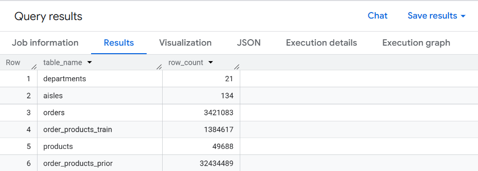

### DISC 02: The eval_set split

Instacart split users into three groups for an ML competition: `prior` (all historical orders), `train` (each user's final order, labeled), and `test` (each user's final order, no labels). The key signal: `train` and `test` show exactly 1.0 orders per user -- confirming they contain only the final order per user, not history. `prior` averages 15.6 orders per user. This is why the two order-product files can't be blindly unioned.

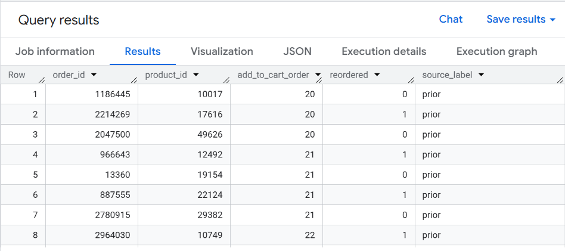

### QC 01: The days_since_prior_order cap

`days_since_prior_order` is capped at 30 by Instacart. A value of 30 does not mean exactly 30 days -- it means 30 or more. The spike at 369,323 orders vs. neighbors in the 19K–32K range makes this visible immediately. This is a censored observation, documented in the staging model so downstream analysts don't build time-decay models on silently broken inputs.

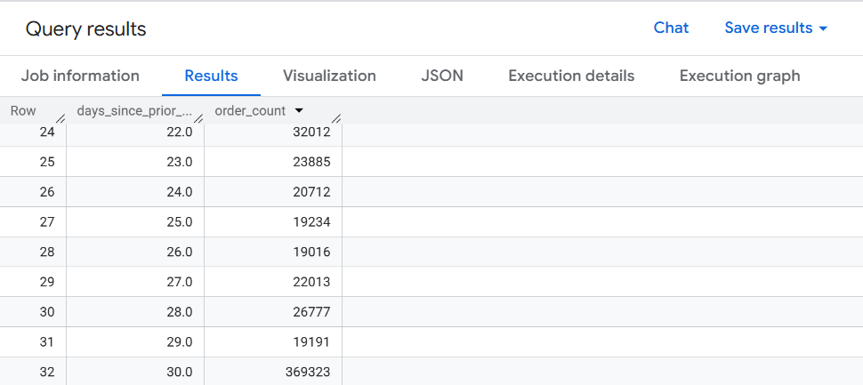

### QC 02: NULL check on first orders

`days_since_prior_order` should only be NULL on a user's first order -- there's no prior order to measure from. The query confirmed 100% null on `order_number = 1` and 0% null on every order after. Clean. Documented in `stg_orders.sql` so no one filters these rows out incorrectly.

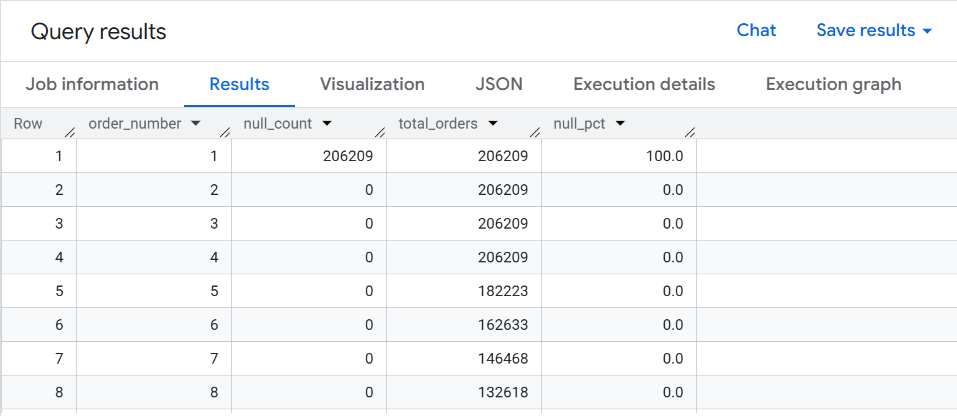

### FIND 01: Reorder rate by department

The first real finding. Dairy eggs (0.67), beverages (0.653), and produce (0.65) are the most reordered departments -- all staple categories where users restock on autopilot. Pets at 0.601 is the most interesting: a small category (97K order lines) with extremely loyal repeat behavior. The bottom of the list is where discovery and impulse buying live.

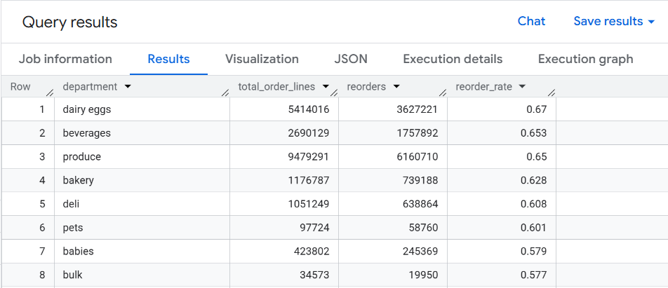

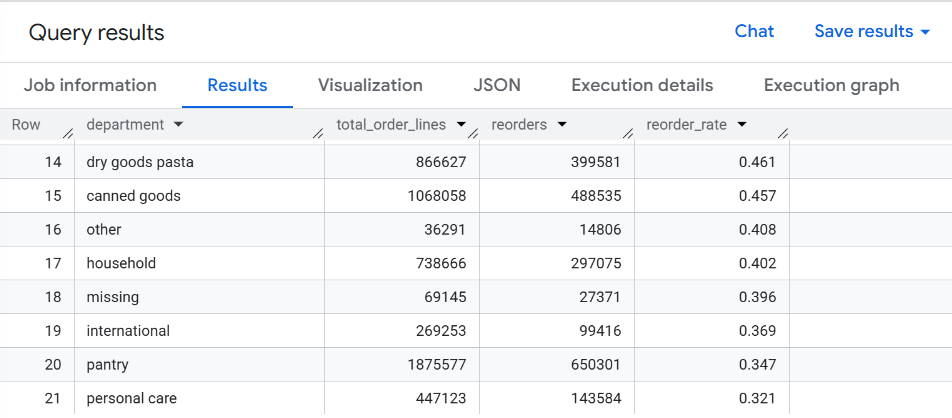

### FIND 02: Reorder behavior by user tenure

This is the finding that answers the thesis. The 0.60 average reorder ratio visible in the Looker Studio dashboard is a population average masking dramatically different behavior underneath.

| Segment | Users | Avg Reorder Ratio | Avg Order Size |
|---|---|---|---|
| New (1-3 orders) | 23,986 | 0.221 | 9.6 items |
| Growing (4-9 orders) | 80,527 | 0.356 | 9.8 items |
| Established (10-19 orders) | 50,965 | 0.516 | 10.0 items |
| Veteran (20+ orders) | 50,731 | 0.670 | 10.3 items |

Reorder behavior doesn't stabilize until around 10 orders. A new user has a 0.221 reorder ratio -- they are still discovering the platform, not yet forming habits. A veteran user reorders 67% of their cart every time. That's a 3x difference between the same metric on the same platform.

**What this means for ML:** Any reorder prediction model trained on all users equally is being diluted by new user noise. The data only becomes reliable for reorder prediction at the Established tier -- 10 or more orders. Users below that threshold behave differently enough that including them in a training set without a segment flag would hurt model performance.

This finding lives in `/analyses/find_02_user_segment_reorder.sql` as a BigQuery view (`vw_user_segment_reorder`) connected to the Looker Studio dashboard.

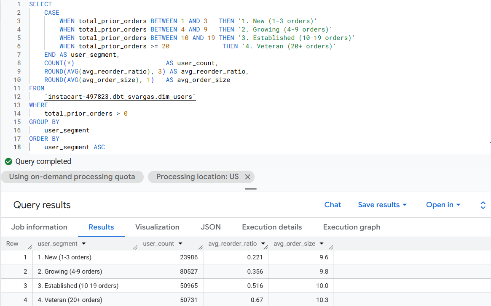

### Test results

35 tests across 3 mart models. All passing.

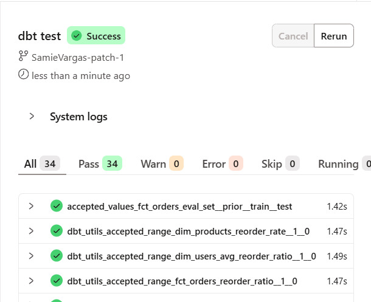

A note on the count. The screenshot predates `models/staging/schema.yml`, which was added later the same day, so it covers mart tests only. `dbt parse` on the committed project today finds 34 tests on the marts and 27 on staging, 61 in total (`unique` 7, `not_null` 47, `accepted_values` 4, `dbt_utils.accepted_range` 3). The one-test difference between the screenshot and the committed mart schema is not recoverable from git history; the marts schema has had a single commit.

The tests that matter most aren't `not_null` and `unique` -- those are table stakes. The ones worth noting:

```yaml
# reorder_ratio is bounded between 0 and 1
# a value above 1 means a join fanout upstream -- caught before it reaches analysts
- name: reorder_ratio
  tests:
    - dbt_utils.accepted_range:
        min_value: 0
        max_value: 1
        where: "eval_set != 'test'"

# days_since_prior_order is only NULL on first orders
# confirmed in qc_02 -- encoded here so the assumption is tested, not assumed
- name: days_since_prior_order
  tests:
    - not_null:
        where: "order_number > 1"
```

### How to reproduce the numbers

1. Load the raw data (How to run, steps 1 to 7).
2. Run `analyses/01_data_discovery.sql` section by section in the BigQuery console. Sections 1 and 2 give DISC 01 and DISC 02; the QC_01, QC_02 and FIND_01 sections give the rest. Each section names the screenshot it produced.
3. `dbt deps`, then `dbt run --full-refresh`, then `dbt test` in dbt Cloud. Every test should pass with zero failing rows.
4. Run `analyses/find_02_user_segment_reorder.sql` in the BigQuery console. It creates `vw_user_segment_reorder` over `dim_users` and returns the FIND 02 table.

---

## Failure modes

| What breaks | How often (from the results) | What catches it | What it costs when it slips |
|---|---|---|---|
| Join fanout in `int_order_products_joined` (a duplicate `product_id`, `aisle_id` or `department_id` multiplies order-product rows) | 0 in the 2026-05-30 run; `reorder_ratio` stayed within 0 to 1 on every non-test order | `unique` on `stg_products.product_id`, `stg_aisles.aisle_id`, `stg_departments.department_id`; `dbt_utils.accepted_range` 0 to 1 on `fct_orders.reorder_ratio`, `dim_products.reorder_rate`, `dim_users.avg_reorder_ratio` | `order_size`, `reordered_items` and every reorder rate inflate together, so the numbers look correct and are wrong. FIND 01, FIND 02 and the Looker Studio dashboard would all report rates nobody could trace back to the bug. |
| Grain drift at a mart (two rows for one order, product or user) | 0 in the 2026-05-30 run | `unique` + `not_null` on `fct_orders.order_id`, `dim_products.product_id`, `dim_users.user_id` | `dim_users` aggregates double count orders; every per-user and per-segment average in FIND 02 shifts. |
| `days_since_prior_order` NULL on an order that is not the first | 0 in QC 02: 100% NULL on `order_number = 1`, 0% on every later order | `not_null` where `order_number > 1` on `stg_orders` and `fct_orders` | Analysts either filter NULLs and drop every first order, or a time-decay model gets gaps it cannot see. |
| The 30-day cap read as an exact 30 | 369,323 orders sit at exactly 30 vs 19K to 32K at the neighboring values (QC 01). This is a property of the source, it is in every run. | `is_days_since_prior_capped` on `fct_orders` and `has_capped_order` on `dim_users`. A flag and a column description, not a test. | A time-decay or order-frequency model is built on a censored input and treats 14x the expected mass at 30 as real measurements. `has_capped_order` rises with tenure, so veteran users are affected most. |
| The eval_set split ignored: prior, train and test unioned as if they were one history | 131,209 train orders and 75,000 test orders are final orders, one per user (DISC 02), in every run | Test set excluded from `stg_order_products`; `source_label` on every row with `accepted_values`; `dim_products` filters to `prior`; `not_null` on the metric columns where `eval_set != 'test'` | Each user's final order counts as history, the labeled outcome leaks into the behavioral features, and reorder rates are computed over a set that has no labels. |
| Test-set orders silently dropped or their NULL metrics treated as a bug | All 75,000 test orders have NULL `order_size`, `reordered_items`, `reorder_ratio` in every run | LEFT JOIN in `fct_orders` keeps them; the `where: "eval_set != 'test'"` clause encodes the expectation instead of a blanket `not_null` | Either 75,000 orders disappear from `fct_orders` and `max_order_number` is wrong for every test user, or a blanket `not_null` fails on every run and gets removed. |
| `dbt run` reports success but writes nothing (target dataset missing, or dbt Fusion thinking the model already exists) | Hit during development; the run completed in under 1 second on a 33M row table | Nothing automatic. The signal is a run under 1 second; the fix is creating `dbt_svargas` first and using `--full-refresh` | Time spent debugging SQL in a file that never saved, and an empty dataset behind a dashboard that reports success. |
| `dbt_utils.accepted_range` undefined because `dbt deps` was not run | Every run until `dbt deps` is run | `dbt parse` in CI fails on the missing package; the error names `dbt_utils` | The three bounds tests that catch join fanout do not exist, so the fanout row above has no catch. |

---

## Not built

- **Cohort model.** The mart layer answers retrospective questions about what users did. The next layer worth building is a cohort model: bucketing users by first-order week and tracking order frequency decay over time. That requires a date spine (`dbt_utils.date_spine` macro) and a left join pattern the current mart structure is already designed to support. It's not in this repo because it belongs in an analytics layer, not a transformation layer. The line matters.
- **First-reorder aisle.** Which aisles are most commonly a user's *first* reorder item, a proxy for habit formation. Still to explore; the mart layer is designed to support this query.
- **FIND 02 inside dbt.** The user segment view is created by hand from `analyses/find_02_user_segment_reorder.sql` in the BigQuery console, so its thresholds are not under test and not in the DAG.
- **Source freshness.** `sources.yml` has no `freshness` block, so `dbt source freshness` has nothing to check. The raw tables are a one-time Kaggle load.
- **Partitioning and clustering on `fct_orders`.** Mentioned as the productionization step; no `partition_by` or `cluster_by` config is set on any model.
- **`dbt run` and `dbt test` in CI.** The GitHub Actions workflow runs `dbt parse` only, because there are no BigQuery credentials in GitHub. Runs and tests happen in dbt Cloud.
- **Recorded query cost.** BigQuery bytes billed for the exploration queries and the dbt runs were not captured, so the Evals cost column reads "not recorded".

---

## Layout

```
instacart_project/
├── .github/
│   └── workflows/
│       └── dbt.yml                       # CI: dbt deps + dbt parse, no warehouse
├── analyses/
│   ├── 01_data_discovery.sql             # All exploration queries in sequence (DISC, QC, FIND 01)
│   └── find_02_user_segment_reorder.sql  # FIND 02: creates vw_user_segment_reorder over dim_users
├── assets/
│   ├── assets_README.md
│   ├── dag_01_full_lineage.png
│   ├── disc_01_table_row_counts.png
│   ├── disc_02_eval_set_split.png
│   ├── disc_03_dbt_svargas_dataset_created.png
│   ├── disc_04_dbt_svargas_all_staging.png
│   ├── disc_05_dbt_svargas_intermediate.png
│   ├── disc_06_dbt_svargas_fct_orders.png
│   ├── disc_07_dbt_svargas_progress.png
│   ├── disc_08_dbt_svargas_dim_products_rowcount.png
│   ├── disc_09_dbt_svargas_dim_products_schema.png
│   ├── disc_10_dbt_svargas_dim_users_schema.png
│   ├── disc_11_dbt_svargas_dim_users_rowcount.png
│   ├── doc_01_dbt_test_all_passing.png
│   ├── find_01_reorder_rate_by_dept.png
│   ├── find_01b_reorder_rate_by_dept_bottom.png
│   ├── find_02_reorder_rate_by_user_segment.png
│   ├── personal_heb_buy_again.png
│   ├── personal_instacart_has_heb.png
│   ├── personal_wf_reorder_history.png
│   ├── qc_01_days_since_prior_cap.png
│   └── qc_02_null_check_first_orders.png
├── macros/                               # empty (.gitkeep)
├── models/
│   ├── staging/
│   │   ├── sources.yml                   # the 6 raw tables in instacart_raw
│   │   ├── schema.yml                    # staging docs + 27 tests
│   │   ├── stg_aisles.sql
│   │   ├── stg_departments.sql
│   │   ├── stg_order_products.sql        # prior UNION ALL train, with source_label
│   │   ├── stg_orders.sql
│   │   └── stg_products.sql
│   ├── intermediate/
│   │   └── int_order_products_joined.sql # 3-way join, built as a table
│   └── marts/
│       ├── dim_products.sql
│       ├── dim_users.sql
│       ├── fct_orders.sql
│       └── schema.yml                    # mart docs + 34 tests
├── seeds/                                # empty (.gitkeep)
├── snapshots/                            # empty (.gitkeep)
├── tests/                                # empty (.gitkeep); all tests are in schema.yml files
├── .gitignore                            # target/, dbt_packages/, logs/
├── dbt_project.yml                       # project name, paths, materializations per folder
├── package-lock.yml
├── packages.yml                          # dbt_utils 1.4.1
└── README.md
```

Running the tests, against BigQuery in dbt Cloud or a local dbt with a real profile:

```
dbt deps
dbt test
```

Without a warehouse, the check that runs is the parse, exactly as CI does it:

```
dbt deps
dbt parse
```

---

*Instacart Online Grocery Shopping Dataset 2017 · Loaded via Kaggle API + bq CLI · Transformed with dbt Cloud on BigQuery*
